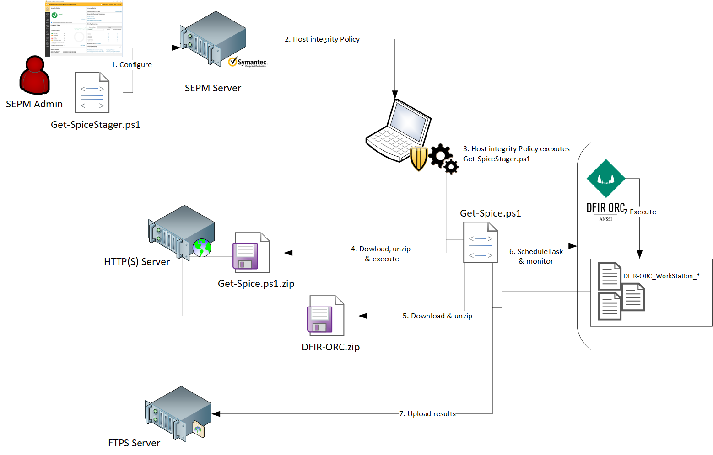

# Get-Spice

Get-Spice (*Get Secure PowerShell Investigation & Control for Endpoint*) is a PowerShell script used to deploy the live-forensic tool [DFIR-ORC](https://github.com/dfir-orc) published by ANSSI. 
It takes advantage of the host-integrity module of Symantec Endpoint Protection (SEP) which allows us to execute code on any host having a SEP client.
If you wish to know more about Get-Spice and how it works, there is an article in the MISC Hors Série n°23 (FR).

Get-Spice works in two stages. The first stage is the powershell script `stager.ps1`. This is the script that will
be executed by SEP through the Host-Integrity policy. This stager will just download and execute in memory (Windows 10 only, file mode for Windows 7) the Get-Spice script that will execute and manage the DFIR-ORC execution and results.

Get-Spice is compatible with Powershell 2.0, Powerhsell 5.0 and Powershell 7.0 and has been tested on Windows 7 and 10. You may have trouble during scheduled task execution if your Windows installation is not in English or French.



## Requirements

* A configured dfir-orc binary (zipped)
* An HTTP(S) server which will host the dfir-orc zip and the second stage script (also zipped)
* An FTP server where the artifacts collected by ORC will be sent to
* An SMTP server. At each execution, the script sends an email with the logfile of the previous execution. That way, if the previous execution failed and wasn't abled to upload the results to the FTP server, you still get the lofgiles.

## Setup


First, let's edit the variables of the second stage.

* $operationName is the name of the folder where the collected artifats will be uploaded to.
* $username and $password are the credentials for the server. If you don't need authentification, you may have to tweak the script to remove the credentials when downloading. 
* $taskname is the name of the scheduled task that runs dfir-orc
* $exename is the name of the .exe of dfir-orc
* $execonfig name of the .xml configuration file of dfir-orc
* $zipfile is the name of the zip of dfir-orc binary
* $url is the url of the server hosting dfir-orc zipfile
* $ftpServer is for the ftp Server where artifcats will be uploaded
* $localdir is the path where orc will be downloaded to and run
* $dest contains the emails address where logs are sent to
* $smtpServer and $smtpSender are self-explanitory


Then, we need to upload the script (zip format) to a server which will be accessible by our hosts. 
You also need to upload your dfir ORC zip archive at the same location.
Any HTTP(S) server will do, but for example with BITS :

```powershell
Start-BitsTransfer -Source .\get-spice.zip -Destination "http://remote-server/get-spice.zip" -TransferType Upload
Start-BitsTransfer -Source .\dfir-orc.zip -Destination "http://remote-server/dfir-orc.zip" -TransferType Upload      
```

Now we configure the first stage variables
* $source is the url where you uploaded the second stage
* $filename is the name of the zip file `get-spice.zip` in our previous example

Now, you should be able to run it locally. Just run the first stage (with admin privileges).
You can check the folder where DFIR-ORC operated in `C:\Windows\Temp\` by default.
The second stage produces a logfile at the `dd-mm-yyy-hostname-run.log` format

If everything is working, the next step is to make it run with SEP.

1. Open the Symantec Endpoint Protection Manager (SEPM)
2. In Policies, Host Integrity click on "Add a Host Integrity Policy"
3. In the Overview side bar, enter an appropriate name, such as "Get-spice" and make sure the policy is enabled
4. In the Requirements side bar, tick "Only do Host Integrity checking when connected to the management server".
5. Click "Add"
   1. Select client platform "Windows"
   2. Select Custom requirements and click OK
   3. You can modify the name of the requirement and click "Add", "Function", "Utility: Run a script"
   4. Modify the file name with something like `stager.ps1` (or something more discrete), this is the name of the script that will be downloaded on disk and executed by the SEP client.
   5. In the script content, copy and paste the code of the stager
   6. In the Execute field paste the command `C:\Windows\System32\WindowsPowerShell\v1.0\powershell.exe -ExecutionPolicy Bypass -File %F% 1> C:\Windows\Temp\getspicelog.txt 2>&1`
   7. For testing purposes you can tick "Show a new process window". For production purposes, leave it unticked.
   8. You can now click "OK"
6. In Advanced Settings, you can set the  "Check Host Integrity every" however you'd like. This will cause the script to execute as frequently as you'd like.

Everything is now set up. Just assign the policy to a group of host that need to be investigated and check your ftp server for the results :)
